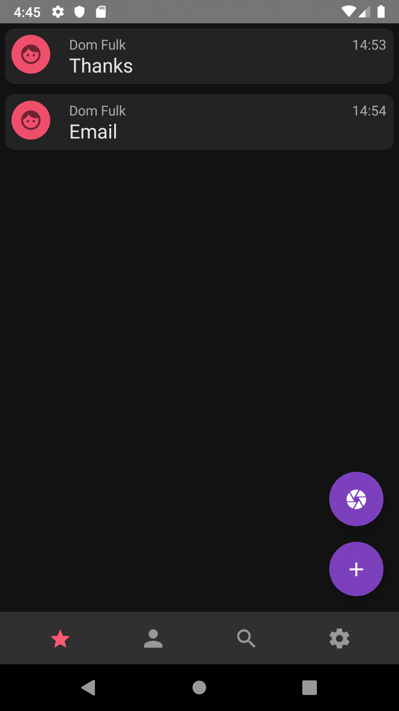
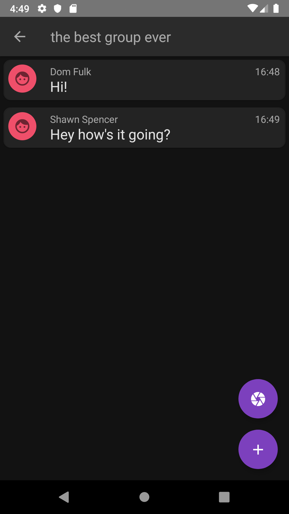

# Bull
Messaging app created with React Native 

## Introduction

This project is a group messaging app that's currently a work in progress. I've been working on it to learn React Native and also by extension help with React.

## Technologies

react-native version: 0.60.5,

react-redux version: 7.1.3,

socket.io-client version: 2.3.0,

## Installation

In order to run this you'll need to have an Android emulator installed. (Theoretically it should be possible to get this to run on ios, but since I don't have a mac and the point of this project was not to learn how to run a virtual machine there are almost certainly a few major bugs).

Clone this repo to your desktop and run npm install to install all the dependencies.
Then you need to run both react-native start and react-native run-android to start the app.

## Features

Send and recieve messages in seperate group spaces,

Send and recieve photo messages,

jwt authentication

Material design standards

## Screenshots

